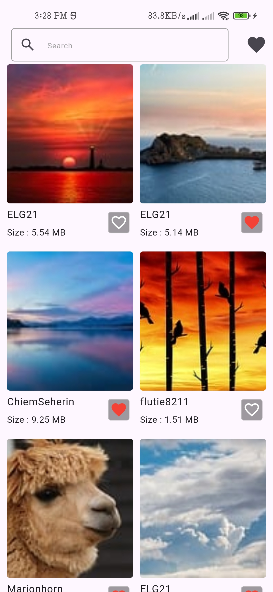
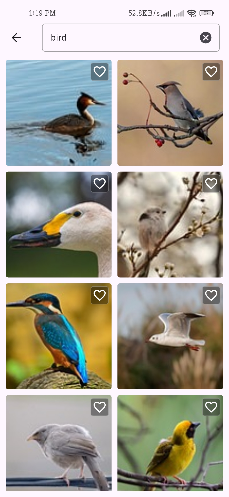
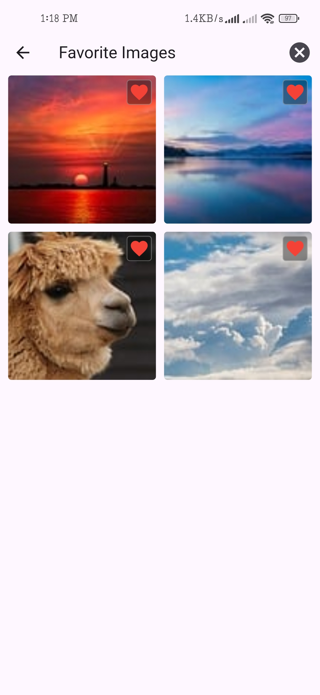
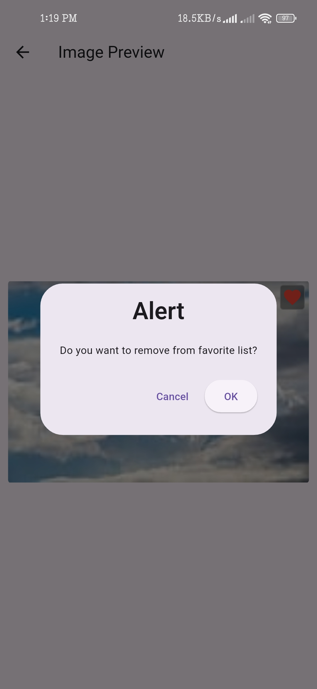
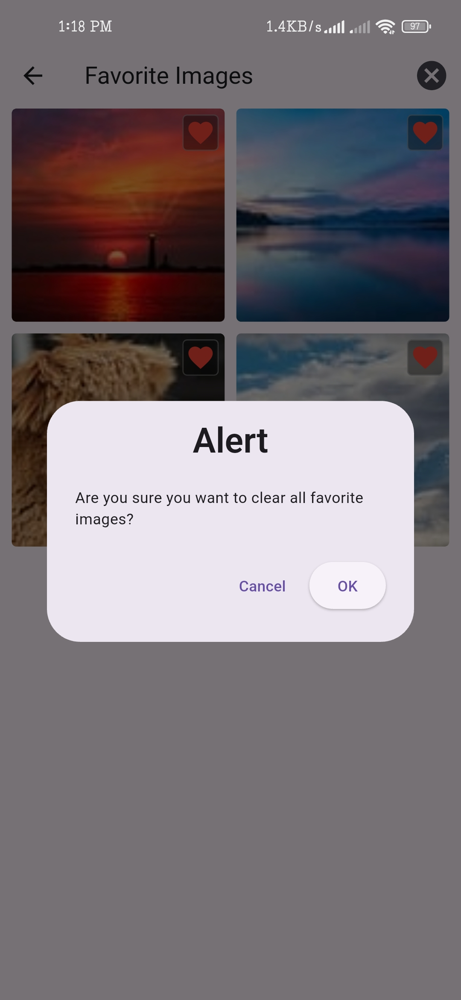

# 📸 image-app

A Flutter application that showcases images in an elegant and interactive UI, with support for favorites, previewing, searching, and offline data storage.

---

## 🚀 Features

- **🏠 Home Screen**
  - Displays images in a grid view.
  - Each image includes a favorite icon to add/remove from favorites.
  - Single tap opens the **Image Preview Screen**.
  - Double tap in preview toggles the image as a favorite.

   

- **🔍 Search Screen**
  - Accessed via a search icon.
  - Allows searching for images.
  - Last search is stored using BLoC state until the session ends or it's cleared.

   

- **❤️ Favorites Screen**
  - Accessed via the favorite icon in the Home AppBar.
  - Displays saved favorite images.
  - Includes a **Clear All** button to remove all saved favorites.

   

- **📦 Local Storage**
  - Uses **Hive** as a local database to persist favorite images.
  - Data remains stored until manually cleared or app is uninstalled.

- **📶 Internet Connectivity Indicator**
  - Shows connection status via a bottom indicator.

    |   

  

---

### Image Preview  
  

### Alert Dialog  
  | 


---

## 🛠 Getting Started


1. **Clone the Repository**:  
```bash  
git clone https://github.com/rohan-165/Image-App.git  
cd Image-App  
```

---

```bash
flutter pub get
flutter run
```

Make sure you have Flutter installed. For more information:

- 📘 [Flutter Documentation](https://docs.flutter.dev/)
- 🎯 [Write your first Flutter app](https://docs.flutter.dev/get-started/codelab)
- 🍽️ [Flutter Cookbook](https://docs.flutter.dev/cookbook)

---


You can save this content in your `README.md` file directly. Let me know if you need help with any specific part of the project setup or codebase!